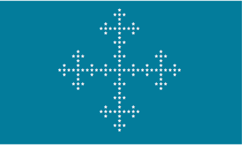
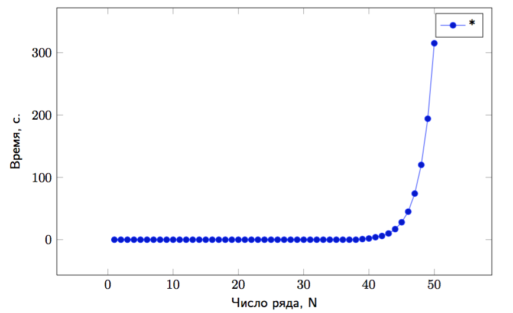
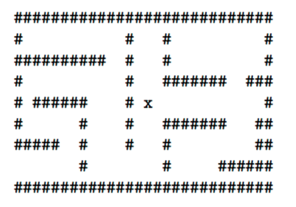

# C-lab-6

## Лабораторная работа №6 (Рекурсия)

### Задача №1

```
Написать программу, которая формирует в двумерном символьном
массиве фрактальное изображение и выводит его на консоль (см.рисунок)
```



**Пояснение**

Фракталом обычно называют изображение, любая часть которого подобна целому. Поэтому, при рисовании фрактала используют рекурсию и некоторый масштабный коэффициент, определяющий размер изображения.

В задаче надо реализовать рекурсивную функцию **drawFractal**, которая формирует изображение в массиве,
расположив его центр в точке с заданными координатами. Переменная *size* задает масштаб изображения: 0 соответствует
одному символу, а >0 означает увеличение масштаба изображенеия.

**Состав**

Программа должна состоять из функций:

```
- void drawFractal(char (*arr)[M], int x,int y, int size) - функция, формирующая изображение
  в массиве arr, центр задается координатами (x,y) и масштаб изображения задается size 
- main() - организация ввода строки
```

Создаются три файла: task1.h,task1.c,main1.c.

### Задача №2

```
Написать программу, которая находит в диапазоне целых чисел от
2 до 1000000 число, формирующее самую длинную последовательность Коллатца
```

**Пояснение**

Последовательностью Коллатца называют числовой ряд, каждый элемент которого формируется в зависимости от чётности/ нечётности предыдущего по закону:

1. n→3n+1, если n нечётное.
2. n→n/2, если n чётное

Начав отсчет с любого числа у нас формируется последовательность Коллатца, например:

- 1
- 2,1
- 3,10,5,16,8,4,2,1
- 4,2,1
- 5,..

Генерация членов последовательности заканчивается, когда появляется единица. Количество элементов и составляет длину
последовательности. В задаче надо перебирать в цикле числа от 2 до миллиона и для каждого считать длину последовательности.
В конце необходимо вывести число, формирующего самую длинную последовательность и длину этой последовательности.

**Состав**

Программа должна включать в себя функции (и, возможно, другие):

```
- unsigned int seqCollatz(unsigned int *maxlen) - функция, возвращающая число и записывающую по адресу maxlen длину 
- unsigned int collatz(unsigned long long num) - функция, возвращающая длину последовательности Коллатца для числа num
- main() - организация ввода строки
```

Создаются три файла: task2.h,task2.c,main2.c.

### Задача №3

```
Написать программу, которая переводит введённое пользователем
целое число в строку с использованием рекурсии и без каких-либо
библиотечных функций преобразования
```

**Пояснение**

Преобразование целого числа в строку можно выполнить разными способами. Одним из самых популярных является способ,
при котором мы находим остаток от деления 10 и тем самым выделяем один (младший разряд). Проблема в том, что в таком
случае формирование строки должно происходить с конца и нам неизвестно количество разрядов числа. С помощью рекурсии
можно сначала разложить число на разряды (прямой ход рекурсии), а потом скопировать эти разряды в правильном порядке
в строку (обратный ход рекурсии).

**Состав**

Программа должна включать в себя функции (и, возможно, другие):

```
- char* int2str(char *buf, unsigned int value) - функция, переводящая число в строку 
- main() - организация ввода целого числа (через scanf)
```

Создаются три файла: task3.h,task3.c,main3.c.

### Задача №4

```
Написать программу, которая суммирует массив традиционным (циклическим) и рекурсивным способами
```

**Пояснение**

Программа выполняет следующую последовательность действий:

- принимает из командной строки значение степени двойки M;
- находит размер динамического массива N = 2^M ;
- выделяет память под динамический массив;
- случайным образом заполняет массив данными;
- находит сумму традиционным и рекурсивыным способом;
- сравнивает время выполнения суммирования традиционным (циклическим) и рекурсивным способами;
- освобождает динамическую память

**Состав**

Программа должна включать в себя функции (и, возможно, другие):

```
- long long sumC(char *arr,int len) - суммирование массива циклом
- long long sumR(char *arr,int len) - суммирование массива рекурсией
- main() 
```

Создаются три файла: task4.h,task4.c,main4.c.

### Задача №5

```
Написать программу, которая измеряет время вычисления N-ого члена ряда Фибоначчи с использованием рекурсии
Предусмотреть вывод таблицы значений для N в диапазоне от 1 до 40
(или в другом диапазоне по желанию) на экран и в файл
```
**Пояснение**

Текстовый файл со значениями можно открыть в электронной таблице и построить график зависимости времени от члена ряда N



**Состав**

Программа должна включать в себя функции (и, возможно, другие):

```
- unsigned long long fib1(int N) - нахождение N-ого члена ряда Фибоначчи с помощью рекурсии
- main() 
```


Создаются три файла: task5.h,task5.c,main5.c.

### Задача №6

```
Написать реализацию рекурсивной функции, вычисляющую n-ый элемент ряда Фибоначчи, но без экспоненциально растущей рекурсии
```
**Пояснение**

Нужно создать две функции: одна вызывается непосредственно из main и вызывает вторую, вспомогательную, которая и является рекурсивной.

**Состав**

Программа должна включать в себя функции (и, возможно, другие):

```
- unsigned long long fib2(int N) - нахождение N-ого члена ряда Фибоначчи
- main() 
```


Создаются три файла: task6.h,task6.c,main6.c.

### Задача №7

```
Написать программу, которая находит выход из лабиринта
```
**Пояснение**

- лабиринт задаётся в виде двумерного символьного массива;
- начальная позиция - в центре;
- программа определяет (по символу),что находится вокруг текущей ячейки;
- если ячейка свободна, программа перемещается в данную точку и всё повторяется;
- программа узнаёт о выходе из лабиринта при пересечении его внешней границы.



**Состав**

Программа должна включать в себя функции (и, возможно, другие):

```
- void place(int x, int y) - перемещение в ячейку массива с координатами (x,y)
- main() 
```


Создаются три файла: task7.h,task7.c,main7.c.

### Задача №8
```
Написать программу, которая вычисляет целочисленный результат арифметического выражения, 
заданного в виде параметра командной строки. Предусмотреть поддержку 4-х основных операций. 
Порядок вычисления определяется круглыми скобками.
```
**Пояснение**

В строке выражения могут встречаться символы: 0-9 , + , - , * , / , ( , ) Выражения могут быть  простыми, то есть целиком состоять из одного числа 3, 8, а могут быть сложными, например, ((6+8)*3) или (((7-1)/(4+2))-9). Предполагается, что скобки в выражении заданы правильно, то есть количество открытых равно количеству закрытых и они на допустимых позициях.

**Состав**

Программа должна включать в себя функции (и, возможно, другие):

```
- int main(int argc, char* argv[]) - главная функция, в которой осуществляется вызов рекурсивной функции eval для вычисления выражения
- int eval(char *buf) - функция, вычисляющая строку, содержащуюся в buf
- char partition(char *buf, char *expr1, char *expr2) - функция, которая разбивает строку, содержащуюся в buf на три части: строку с первым операндом, знак операции и строку со вторым операндом
```

Создаются три файла: task8.h,task8.c,main8.c.


